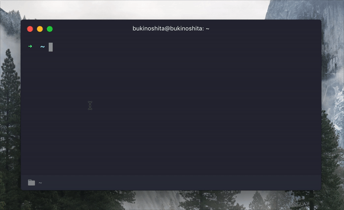

# metrosp-status-cli  [](https://travis-ci.org/bukinoshita/metrosp-status-cli)

> A real-time CLI for MetroSP status


## Install

```bash
$ npm install -g metrosp-status-cli
```


## Usage

```bash
$ metrosp --help

  Usage:
    $ metrosp                   Show metrosp status

  Options:
    -h, --help                  Show help options
    -v, --version               Show version
```


## Demo




## Related

- [metrosp-status](https://github.com/bukinoshita/metrosp-status) — API for this module


## License

MIT © [Bu Kinoshita](https://bukinoshita.io)
